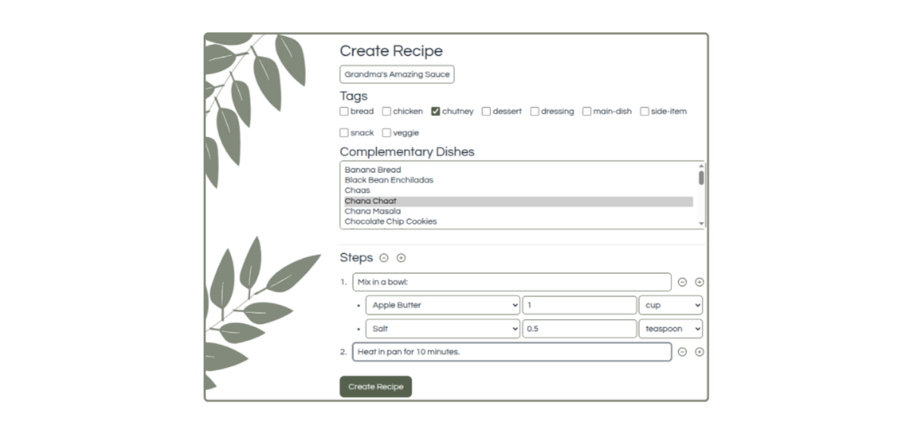

# Recipe Book

A Django project to keep your favorite recipes.

Recipe Book stores your family recipes for easy access, without the bloat of ads and popups on other recipe sites. The design is intentionally minimal to get you to what you want: the recipe. You can...

- View recipes and mark your favorites.
- Create new recipes or edit existing ones.
- Manage ingredients for reuse in multiple recipes.


## Installation
Requirements:

- Python 3.13+
- [uv](https://docs.astral.sh/uv/getting-started/installation/)

### Get Code

```bash
git clone https://github.com/kishanpatel789/recipe_book.git
cd recipe_book
```

### Create Virtual Environment
Then create the virtual environment by running `uv sync`.

### Configure App

Use the template to create a `.env` file.

```bash
cp .env.template .env
```

Populate the .env file with the requested values:

- `SECRET_KEY`: used in [Django settings](https://docs.djangoproject.com/en/5.2/ref/settings/#std-setting-SECRET_KEY) for cryptographic signing. You can run a quick command like `python -c 'import secrets; print(secrets.token_hex())'`.
- `DATABASE_URL`: a connection string to a database. For sqlite, you may use something like `DATABASE_URL=sqlite:///db.sqlite`.

Run the following commands to set up the database tables and populate them with seed data.

- `uv run python manage.py migrate`: creates required tables in the database
- `uv run python manage.py setup_roles`: creates two Django groups. Group "cook" has read-only access; group "chef" has read-write access.
- `uv run python manage.py create_users`: creates demo users "chef" and "cook", which are assigned to respective groups

## Usage

The webapp will begin with no recipe data. For demo purposes, run the following management command to create starter recipes. WARNING: Running this command will remove existing recipe data in the database.

```bash
uv run python manage.py seed_full
```

To run the app locally, execute the standard Django command:

```bash
uv run python manage.py runserver
```

Go to the webapp at `http://localhost:8000`. Anyone can view recipes, but logging in will open up more features.

- Log in with "chef" access:
  - Username: `chef`
  - Password: `pass12345`
- Log in with "cook" access:
  - Username: `cook`
  - Password: `pass12345`


There are a few things you can do when logged in:

- View list of recipes
  - Create a new recipe (for "chef" users only)
- View details of one recipe
  - Favorite a recipe
  - Edit steps and ingredients in-line (for "chef" users only)
  - Delete a recipe (for "chef" users only)
- Manage ingredients (CRUD operations for "chef" users only)

Recipes are designed with nested lists. A recipe has many steps and each step can have a sublist of ingredients. This design choice makes the ingredients readable as soon as they are needed for a given step. When creating a recipe, use the "+" button to add more input forms for steps or ingredients. Similarly, use the "-" button to remove step and ingredient inputs.



### Admin Usage

The backend [Django admin site](https://docs.djangoproject.com/en/5.2/ref/contrib/admin/) can be reached at `http://localhost:8000/admin`. The admin site has been set up to manage user accounts and to make full changes to the recipe data.

It's recommended to create a superuser for accessing the admin site: `python manage.py createsuperuser`

## Architecture

Recipe Book is built to serve a family. Family members can load their recipes and share them with read-only access to others. All data is stored in the database you choose (Postgres is recommended).

Django is used to interact with the database and serve the web application. TailwindCSS is used for styling and HTMX is used for Javascript-like interactivity.


## Contributing

Pull requests are welcome. For major changes, please [open an issue](https://github.com/kishanpatel789/recipe_book/issues) first to discuss what you would like to change.

Please make sure to update tests as appropriate.

## License

[MIT](https://choosealicense.com/licenses/mit/)
